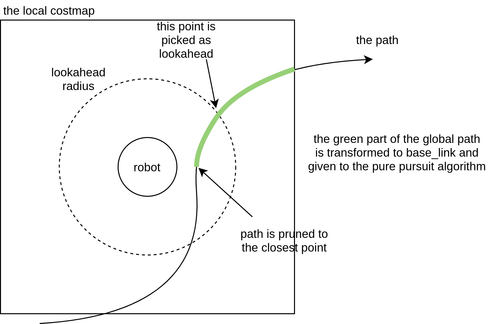

# Nav2 Pure pursuit controller

Tutorial code example is referenced in https://navigation.ros.org/plugin_tutorials/docs/writing_new_nav2controller_plugin.html

This controller implements a variant on the pure pursuit algorithm to track a path. This variant we call the Regulated Pure Pursuit Algorithm, due to its additional regulation terms on collision and linear speed.

## How the algorithm works
The global path is continuously pruned to the closest point to the robot (see the figure below).
Then the path is transformed to the robot frame and a lookahead point is determined.
This lookahead point will be given to the pure pursuite algorithm to calculate a command velocity.

## Features

This implementation has a number of non-standard features.
- Collision avoidance in the computed velocity direction between the robot in the look ahead point to ensure safe path following. Uses a maximum collision time parameter to inform the amount of time to forward simulate for collisions. Set to a very large number to always forward simulate to the carrot location
- Optional dynamic scaling of the look ahead point distance proportional to velocity. This helps you have a more stable robot path tracking over a broader range of velocity inputs if your robot has a large band of operating velocities. There are parameters for the minimum and maximum distances as well.
- Optional slow on approach to the goal. The default algorithm tracks a path at a given linear velocity. This feature allows you to slow the robot on its approach to a goal and also set the minimum percentage (from 0.0-1.0) on approach so it doesn't approach 0% before attaining the goal.
- Kinematic speed limiting on linear velocities to make sure the resulting trajectories are kinematically feasible on getting up to speed and slowing to a stop.
- Optionally scaling linear velocity by its proximity to obstacles and curvature. This is helpful to slow the robot when moving close to things in narrow spaces and scaling down the linear velocity by curvature helps to stabilize the controller over a larger range of lookahead point distances. The major benefit of scaling by curvature is to create intuitive behavior of slowing the robot when making sharp turns and also de-sensitising the look ahead distances which would otherwise be more sensitive to overshoot in some such cases (e.g. average users require little tuning to get reasonable behavior). A secondary benefit of scaling by curvature is to all the robot to natively rotate to rough path heading when using holonomic planners (e.g. don't align starting pose orientation with current robot orientation or in preempted commands changing path directions) without explicit 'rotate to heading' commands.

## Topics and parameters

This package will also publish a few useful topics:
- lookahead point: the position at which the lookahead point is located the robot is attempting to follow
- lookahead arc: the arc produced by the pure pursuit algorithm for debug visualization while tuning. It is also the points on the path that the collision detector is running. In a collision state, the last published arc will be the points leading up to, and including, the first point in collision. It is also a really great speed indicator, when "full" to carrot or max time, you know you're at full speed. If 20% less, you can tell the robot is approximately 20% below maximum speed. Think of it as the collision checking bounds but also a speed guage.

Parameters table

## Notes to users

- On tuning look ahead point for desired behavior (wiggling / overshoot / cuttoff stuff)
- On using velocity based lookahead range rather than static
- On on-approach velocity scaling
- On linear velocity scaling by curvature / cost
- On rotate to heading / goal (?)

## TODO
- param table
- topics table
- better intro / description / gif / images
- fill in notes to users
- cleanup features section